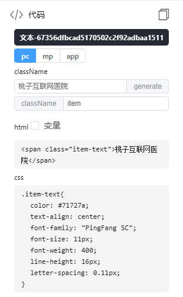
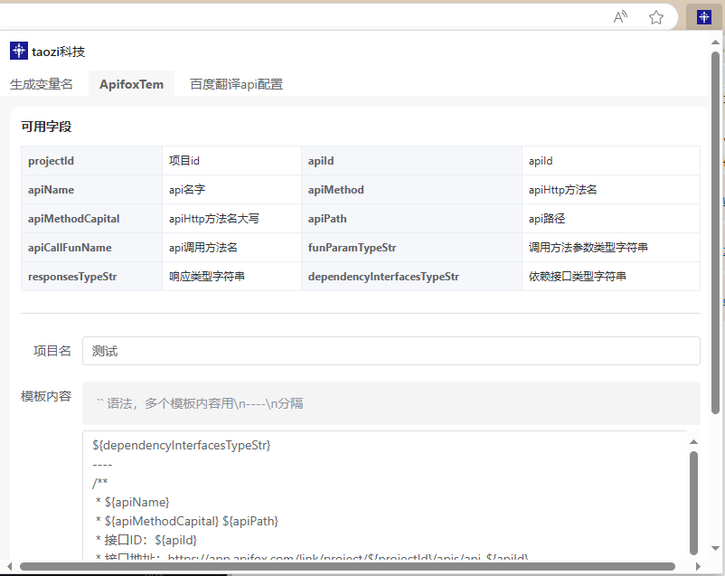
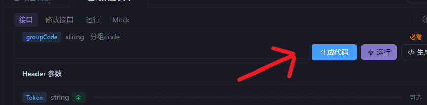
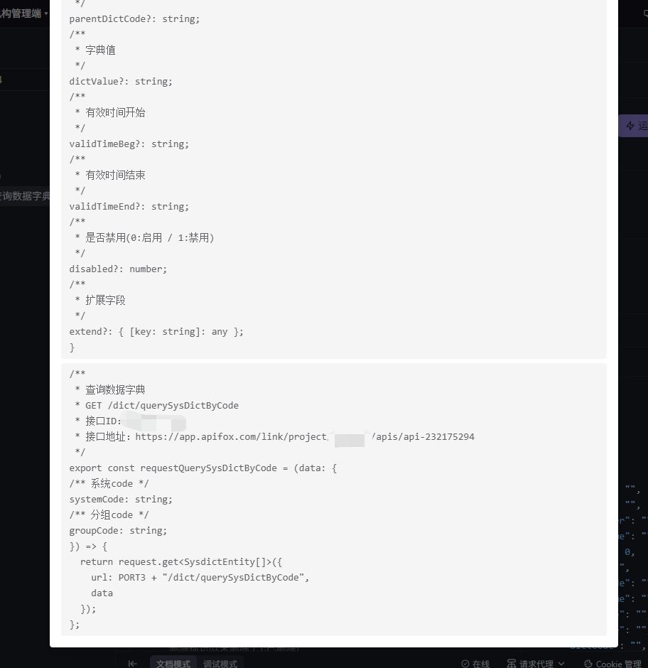

# taozi 科技的谷歌浏览器扩展

## 使用方法

### 1.下载 release 的包

- 解压
- 然后进入浏览器扩展管理页面 `chrome://extensions/`
- 打开开发者模块
- 点击加载已解压的扩展程序，然后选择解压目录就行了

### 2.自己拉代码构建

- 先执行`pnpm i`
- 在执行 `pnpm run build-package`
- 根第一种方式一样，只不过加载已解压的扩展程序时选择`./extensions`

## 功能

### 根据 codesign.qq.com 里面的样式快速生成需要的代码，并过滤掉多余的 css 样式

### 根据 apifox.com 的 api 信息快速生成 api 调用代码

先配置调用代码的模板

然后点击按钮

就能生成 api 调用代码了

